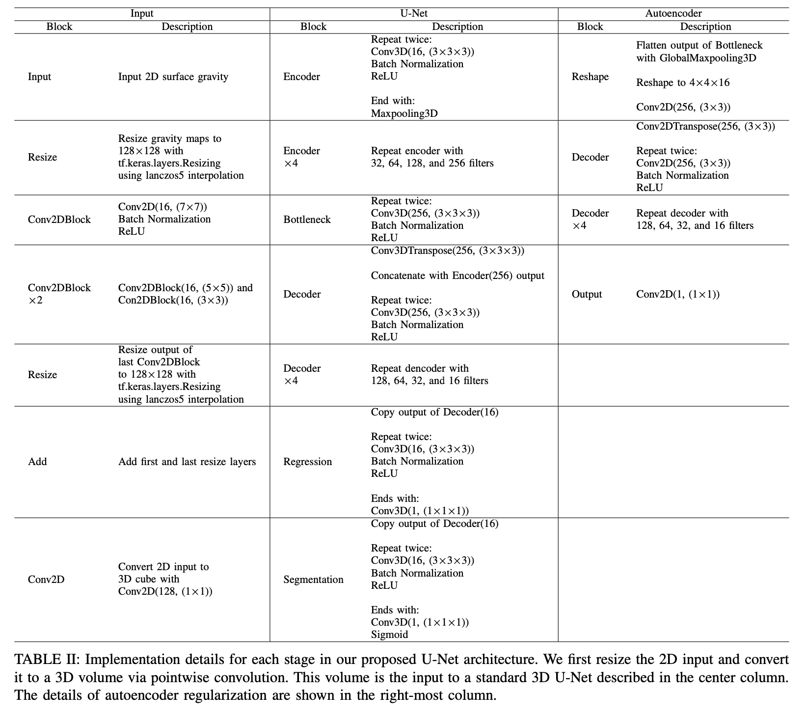
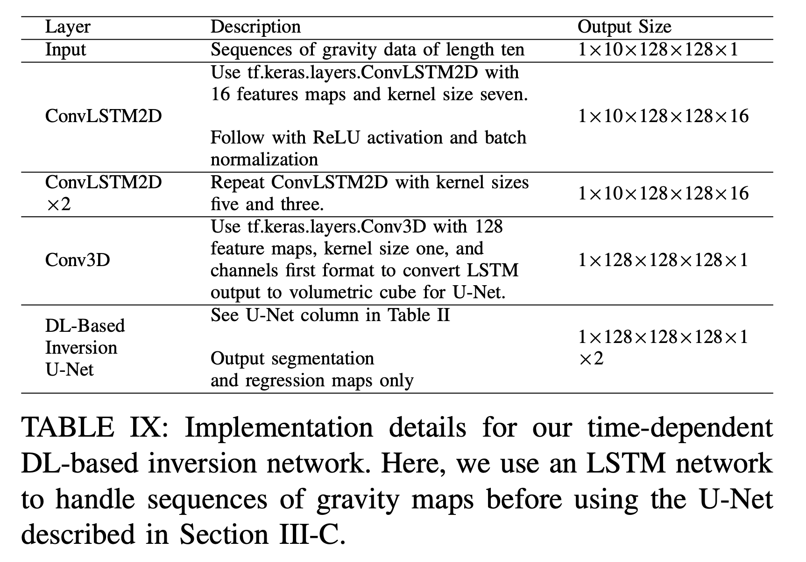

# Implementation Details for Surface Gravity Inversion Networks

Implementation details for deep learning networks described
in "Inversion of Time-Lapse Surface Gravity Data for Detection of 3D CO2 Plumes via Deep Learning."

https://arxiv.org/abs/2209.02850

## Pure Deep Learning Approach

## Time Dependent Network

